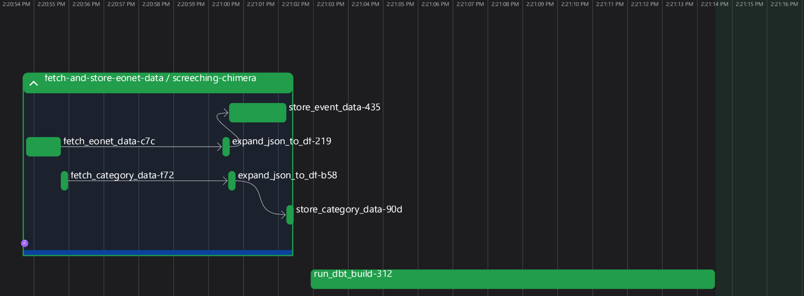

# NASA EONET Event ETL Process
## Overview
This repository demonstrates the ETL process of pulling data from a source (in this case, NASA's EONET API), storing it in a database, transforming it directly within that database, and loading it into charts/summaries to provide statistics about the information.

Earth Observatory Natural Event Tracker [(EONET)](https://eonet.gsfc.nasa.gov/) is an open source API that provides a curated reference of near real-time, consistently updated natural event metadata. This includes events such as wildfires, severe storms, droughts, earthquakes, etc. as well as their magnitude and location.

## Technologies Used
### Extraction/Loading:
- Python is used for API interfacing, specifically the *requests* library
- *Pandas* dataframes are used as an intermediate step before loading the raw data directly into a *DuckDB* database

### Transformation
- Data Build Tool [*(dbt)*](https://www.getdbt.com/) is used for heavy-lifting transformation of data directly within the database
- *dbt* transforms data through staging, intermediate, and mart layers in addition to running tests to ensure schema compliance

### Orchestration
[Prefect](https://dagster.io/) is used to orchestrate and execute the pipeline at set intervals (6 hours). Two flows are used: One to fetch and load the data from the EONET endpoint, and one to run the *dbt* build.

### Analytics
An Evidence.dev page queries the database to provide analytical information regarding event types, trends, and locations. See the [Evidence.dev](https://gmodery.github.io/EONET-ETL/) page for details.

### Additional Development
Additional development is enabled by the FastAPI module that serves the processed API data. This allows for the development of other projects that may need to access this data already in its cleaned format.